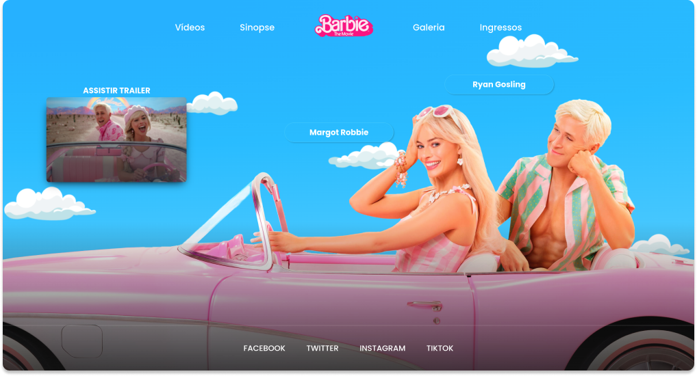

<h1 align="center">
  Recriando o site da Barbie
</h1>

  

## 💻 Projeto

Este projeto é um tutorial que ensina a recriar o site do fime da **Barbie** com _HTML_ e _CSS_. 

Link do site oficial: [barbiefilme.com.br](https://www.barbiefilme.com.br/home/).

## 🚀 Tecnologias

- HTML
- CSS

## 📔 Conhecimentos abordados

- [x] Uso semântico do HTML
- [x] Animação com imagens
- [x] Váriaveis do css no `:root`
- [x] Uso do CSS Flexbox
- [x] Efeitos com a propriedade `transform`

## 📺 Tutorial no Youtube

